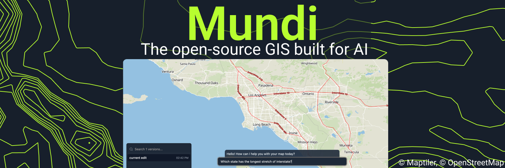

# Mundi

<h4 align="center">
  
  
  
  
</h4>

## Documentation

Get started with Mundi using our guides:

- [Making your first map](https://docs.mundi.ai/getting-started/making-your-first-map/)
- [Self-hosting Mundi](https://docs.mundi.ai/guides/self-hosting-mundi/)
- [Connecting to PostGIS](https://docs.mundi.ai/guides/connecting-to-postgis/)

Find more at [docs.mundi.ai](https://docs.mundi.ai).

## Comparing open source Mundi and cloud/enterprise Mundi

Mundi has both open source and cloud/enterprise versions. This is because we think the future
of GIS software is open source and AI-native, while enabling corporations to sponsor its development.

|                        | Open source Mundi        | Mundi Cloud / Enterprise         |
|------------------------|--------------------------|----------------------------------|
| Third-party services   | None                     | Integrated                       |
| Optimized for          | Local/open LLMs          | Frontier & proprietary models    |
| Multiplayer?           | Single player            | Team collaboration               |
| Support                | Community                | SLAs available                   |
| License                | AGPLv3                   | Commercial                       |

## License

Mundi is licensed as [AGPLv3](./LICENSE).

Optionally, Mundi can use [QGIS](https://qgis.org/) for geoprocessing.
[The code that links with QGIS](./qgis-processing) is licensed
as [GPLv3](./qgis-processing/LICENSE).
