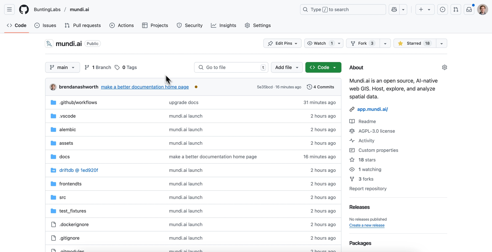
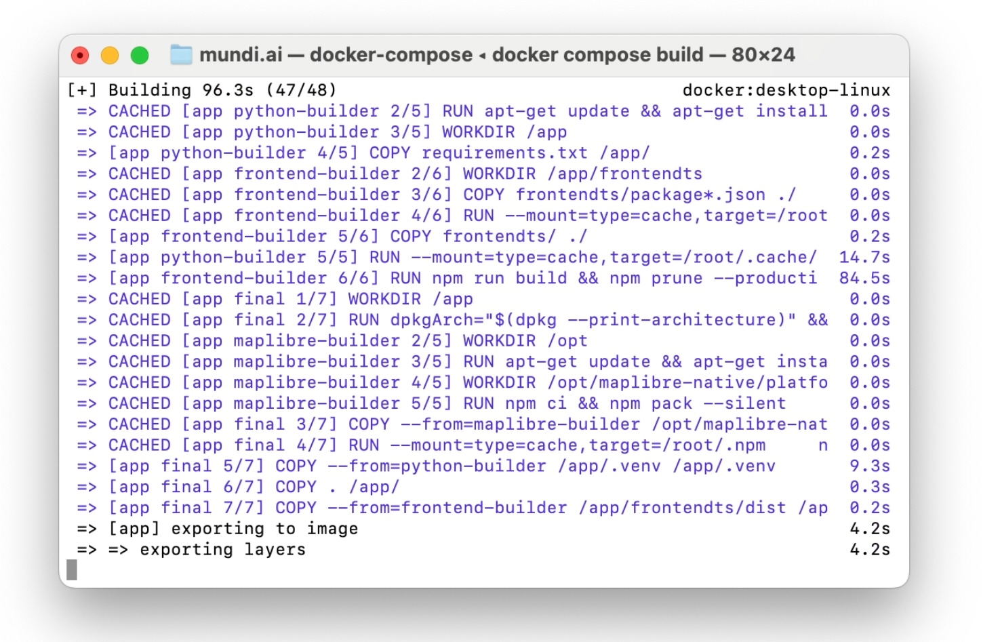
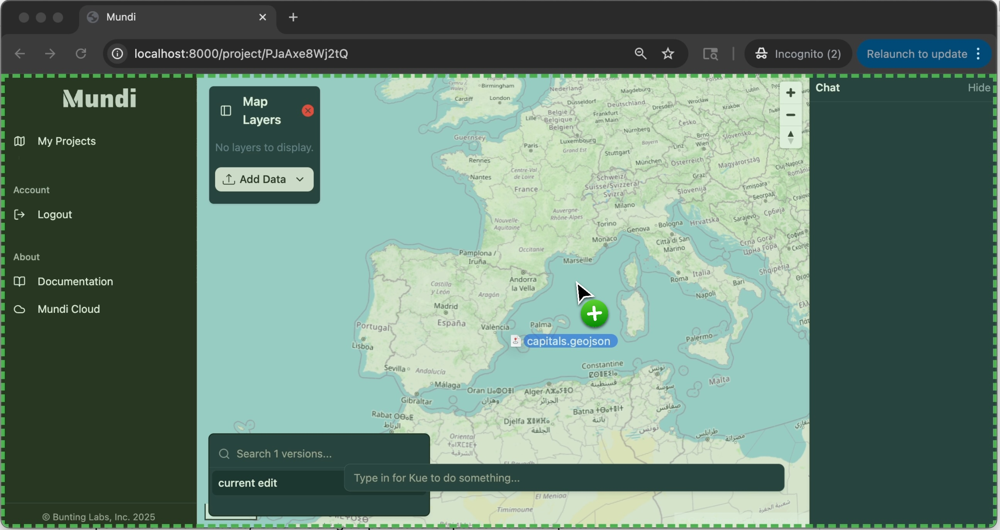

Mundi is an open-source, AI-native web GIS licensed under the
[AGPL-3.0](https://github.com/BuntingLabs/mundi.ai/blob/main/LICENSE).
This means you can self-host it on your own hardware, whether that's your
local laptop or a virtual private server.

This guide will walk you through the process of setting up and running
Mundi locally using Docker.

### Prerequisites

Before you begin, ensure you have the following:

* **Docker Desktop**: Mundi is distributed as a set of Docker containers,
  so you'll need [Docker](https://docs.docker.com/desktop/) installed and running on your system.
* **System Resources**: For a smooth experience, I recommend a machine
  with at least **4 CPU cores** and **4 GB of RAM**. I use a MacBook Pro.

### Setup

1. First, clone the Mundi repository from GitHub. Open your terminal,
   navigate to a directory where you want to store the project, and run:

    ```bash
    git clone https://github.com/BuntingLabs/mundi.ai.git
    ```

    

2. Navigate into the new `mundi.ai` directory and initialize the git
   submodules. Mundi uses a submodule for its database component, and this
   step ensures it's properly downloaded.

    ```bash
    cd mundi.ai
    git submodule update --init --recursive
    ```

3. Now, build the Docker containers. This command reads the
   `docker-compose.yml` file and builds all the services Mundi needs,
   including the main application, the database, and the object store.
   This may take a few minutes the first time you run it.

    ```bash
    docker compose build
    ```

    

### Running Mundi

With the services built, you can now start the application.

1. Run the following command to start the Mundi application stack:

    ```bash
    docker compose up app
    ```

    You will see logs from the various services starting up. Note that you
    may see a warning like `The "OPENAI_API_KEY" variable is not set`.
    This is expected, as we haven't configured an LLM yet. (tutorial coming soon)

    

2. Once the server is running, open your web browser and navigate to
   `http://localhost:8000`. You should see the Mundi welcome screen, ready
   to create your first map.

### Creating Your First Map and Adding Data

Now that Mundi is running, you can start using it.

1. Click **Create Your First Map**. This will generate a new project and
   take you to the map interface.

2. While the AI chat functionality is disabled without an API key, you can
   still add data directly. Simply drag and drop a GeoJSON, Shapefile
   (zipped), or GeoPackage file onto the map.

    Here, I'm adding a GeoJSON file of US state capitals. Mundi
    automatically uploads the data and renders it on the map.

    

### Stopping the Server and Data Persistence

Your data is not lost when you shut down the application.

1. To stop the server, return to the terminal where `docker compose` is
   running and press **`Ctrl+C`**.
2. All your data, including map projects and uploaded files, is persisted
   locally in the `data/` directory within your `mundi.ai` project folder.
   This means you can stop and restart the server anytime without losing
   your work.

    

## Advanced self-hosting

### Read-only mode

When you self-host Mundi, it runs in **edit mode** by default. This mode
is designed for a trusted environment where any user who can access the
application is allowed to add, edit, and delete data.

For sharing maps publicly, you can configure Mundi to run in
**read-only mode**, which prevents viewers from making changes to the
data. This can be changed by setting the environment variable `MUNDI_AUTH_MODE=view_only`
in the `docker-compose.yml` file. It defaults to `edit`.

### SSL configuration

If you use HTTPS with Mundi, then you'll also need to edit the `driftdb` configuration to instruct the application
to route WebSocket connections over WSS.

You need to modify the `docker-compose.yml` file:

1. Locate the `driftdb` service in your `docker-compose.yml` file
2. Uncomment the `USE_HTTPS_WSS=1` environment variable:

```yaml
driftdb:
  platform: linux/amd64
  image: ${DRIFTDB_IMAGE:-driftdb-local}
  build:
    context: ./driftdb
    dockerfile: driftdb-server/Dockerfile
  environment:
    - USE_HTTPS_WSS=1  # Uncomment this line
    - HOSTNAME_OVERRIDE=localhost:5173
  restart: unless-stopped
```

You may also decide to update `HOSTNAME_OVERRIDE` to match your domain though this may not be needed. The port and hostname
should reflect what the end JavaScript frontend application should connect to, not the internal port and hostname of your server.
