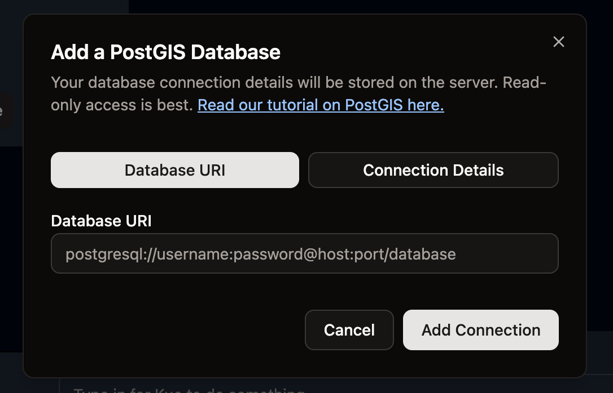

# Connecting to PostGIS

PostGIS is a powerful spatial database extension for PostgreSQL that enables you to store, query, and manipulate geographic data. This guide will walk you through connecting to a PostGIS database in Mundi.

## Prerequisites

- A running PostGIS database
- Database connection credentials (host, port, database name, username, password)
- Network access to the PostGIS server

## Connection Steps

### 1. Access the Database Connection Dialog

Click on the "Add Data Source" button or navigate to the database connection interface in Mundi.

### 2. Enter Connection Details

Fill in your PostGIS connection parameters:

- **Host**: The server address where your PostGIS database is hosted
- **Port**: Usually 5432 for PostgreSQL/PostGIS
- **Database**: The name of your PostGIS database
- **Username**: Your database username
- **Password**: Your database password

### 3. Test and Connect

After entering your credentials, test the connection to ensure everything is configured correctly. Once verified, establish the connection to your PostGIS database.

## Working with PostGIS Data

Once connected, you can:

- Browse available spatial tables and views
- Query geographic data using spatial SQL
- Visualize spatial data on maps
- Perform spatial analysis operations

### Connecting from QGIS

You can also connect to the same PostGIS database from QGIS for advanced GIS operations:

This allows you to work with the same spatial data across both Mundi and QGIS environments.

## Best Practices

- Use connection pooling for better performance
- Ensure your PostGIS database has proper spatial indexes
- Keep your PostGIS extension updated
- Use appropriate spatial reference systems (SRS) for your data

## Troubleshooting

If you encounter connection issues:

1. Verify your network connectivity to the database server
2. Check that the PostGIS service is running
3. Confirm your credentials are correct
4. Ensure the database allows connections from your IP address
5. Verify the PostGIS extension is properly installed on the database