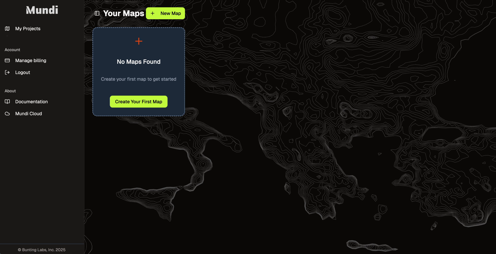
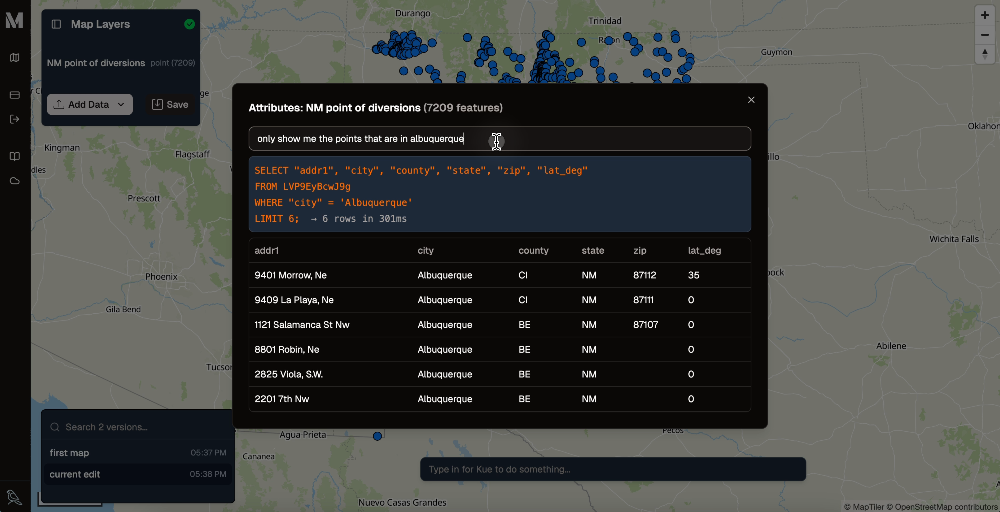

Mundi is an open-source web GIS. At its core is **Kue**, an AI agent that works alongside you in the map editor.

This guide will walk you through the entire process of creating your first map, from a blank slate to a fully styled and saved project.

## Creating a map

When you first log in to [Mundi](https://app.mundi.ai), you'll land on the "Your Maps" dashboard. If you don't have any maps yet, you'll see a prompt to create one.

1.  Click the **Create Your First Map** button to get started.

2.  Mundi will instantly generate a new map project for you, which appears as a card on your dashboard.

3.  Click the **Open** button on the new map card to launch the map editor.

## Uploading data to the map

To add your own data to an empty map, you can either use the "Add Data" button or drag and drop files directly onto the map canvas.

Drag your dataset (e.g., `.gpkg` file or a `.zip` file containing `.shp`, `.shx`, `.prj` etc) from your computer and drop it anywhere on the map canvas.

Mundi will automatically upload and process the file. Once complete, your data will appear on the map, and a new layer will be added to the **Map Layers** panel on the left.

Notice the layer name is highlighted in green. This signifies that the layer is a new, unsaved addition to your map.

## Querying in the AI attribute table

Before styling, it's helpful to understand the data you're working with. Mundi's attribute table allows you to inspect the features and even query them using natural language.

1.  Right-click the new layer in the **Map Layers** panel and select **View attributes**.

2.  The attribute table will open. Here, you can type a natural language query into the search bar. For example, to find all points within Albuquerque, you can type:
    > *only show me the points that are in albuquerque*

3.  Kue will translate your request into a SQL query and filter the table accordingly, showing you only the relevant records.

## Styling your map with natural language

This is where Kue truly shines. Instead of navigating complex symbology menus, you can just describe how you want your map to look.

1.  In the Kue chat prompt at the bottom of the screen, type a styling request. Let's style the points based on the county they are in.
    > *can you style the point of diversions based on the county*

    Kue will analyze the data, identify the "county" attribute, and apply a categorized style with different colors for different counties.

2.  You can iterate and refine the style. In the initial result, many counties were left gray. We can ask Kue to improve this:
    > *great. lots of the counties are gray, I think you should list out more counties in new mexico for the symbology*

    Kue will update the color palette to include more counties, giving you a much more informative and visually appealing map.

## Saving versions of your map

Mundi uses a versioning system similar to Git. Every time you save, you create a new, distinct version of your map. This allows you to experiment freely, knowing you can always revert to a previous state.

1.  Click the **Save** button.
2.  A new version is created in the versions list on the left. The `current edit` becomes the new saved state, and you are now working on a new set of "no edits."

This creates a complete history of your work, making your workflow robust and non-destructive.

You've now created your first map with Mundi!