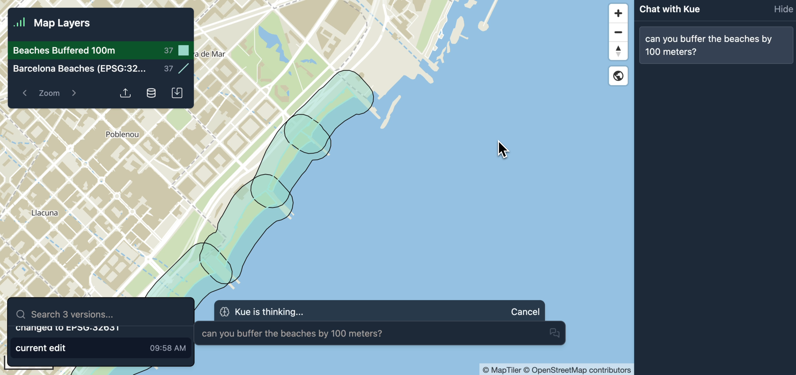
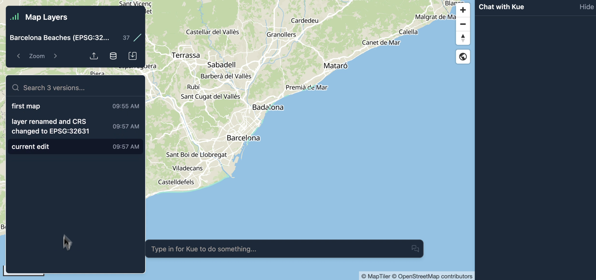

Mundi's AI agent, Kue, is integrated with [QGIS's](https://qgis.org/) geoprocessing
algorithms. This means you can use QGIS's 300+ algorithms from Mundi.

This tutorial demonstrates how to perform a common two-step geoprocessing
task: reprojecting a layer to a suitable coordinate system and then
creating a buffer around its features.

### Reproject vectors to local CRS

To begin, we'll work with some beaches downloaded from [OpenStreetMap](https://www.openstreetmap.org/) that
contain linestring geometries.

1.  Drag and drop your data file onto the map.

2.  Mundi will automatically load and display the layer.

Before we can create a buffer with a specific distance (e.g., 100 meters),
we need to ensure our data is in a suitable Coordinate Reference System (CRS).

Our initial beaches layer is in a geographic CRS, **EPSG:4326**,
where the units are in decimal degrees. Distance-based operations like
buffering require a projected CRS where units are linear (like meters or
feet). When hovering over a vector layer in the layer list, you'll see
the layer's CRS.

We can ask Kue to handle the reprojection for us. Mundi cloud uses frontier models
that are intelligent enough to select the CRS for you, but depending on your local model
choice, you may need to request the EPSG code specifically.

1.  In the Kue chat box, type a request to reproject the layer.

    > can you reproject barcelona beaches to a local crs?

2.  Kue will identify the correct QGIS algorithm (`native:reprojectlayer`)
    and execute it, choosing **EPSG:32631 (UTM Zone 31N)** as the
    appropriate local CRS for Barcelona.

3.  A new, reprojected layer is added to your map.

### Buffering by 100 meters

With the layer now in a projected CRS, we can create a buffer using metric
units.

1.  Ask Kue to buffer the newly reprojected layer. You can refer to the
    layer by its name.
    > can you buffer the beaches by 100 meters?

2.  Kue will run the QGIS `native:buffer` algorithm.

3.  A new polygon layer named "Beaches Buffered 100m" is created and added to
    the map. Kue also applies a semi-transparent blue fill style for clear
    visualization.

## Managing Your Workflow with Versioning

As you perform these operations, Mundi's built-in version control tracks
every change.

-   **Save snapshots**: After each major step, like reprojecting or
    buffering, click the **Save** icon (fork) to create a new version of
    your map.

-   **Clean up layers**: You can delete intermediate layers (like the
    original `EPSG:4326` layer) to keep your map tidy.

-   **Revert changes**: If you make a mistake, you can always revert to a
    previous version of the map using the version history panel in the
    bottom-left corner.

