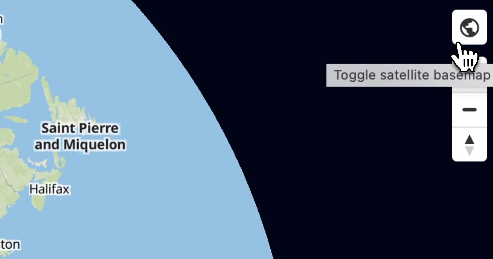
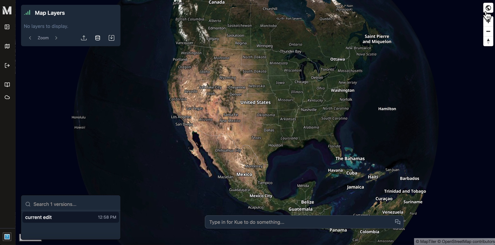
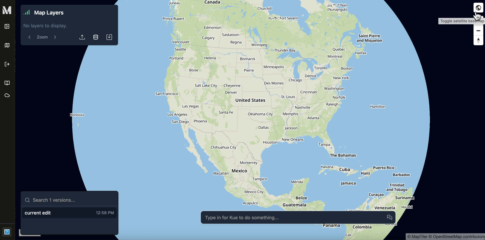

:::note[Limited to Mundi Cloud + On-Premise]
Open source Mundi only supports OpenStreetMap basemaps because there are no free satellite imagery providers.
:::

Mundi provides multiple basemaps to help you visualize your data with
different contextual backgrounds. By default, Mundi displays a traditional
vector basemap. You can easily switch to a satellite imagery view for a more
photorealistic context.

## Toggling basemaps

1.  To switch basemaps, locate the **Toggle satellite** button in the top right
    corner of the map view. It is represented by a globe icon.

2.  Click the globe icon. The basemap will instantly switch to a satellite
    imagery view.

You can click the same icon again at any time to toggle back to the
traditional vector basemap.

## Video Tutorial

<iframe width="560" height="315" src="https://www.youtube.com/embed/13hiJNyqCtA?si=_8j90Y3NL_bhS7_c" title="YouTube video player" frameborder="0" allow="accelerometer; autoplay; clipboard-write; encrypted-media; gyroscope; picture-in-picture; web-share" referrerpolicy="strict-origin-when-cross-origin" allowfullscreen></iframe>
