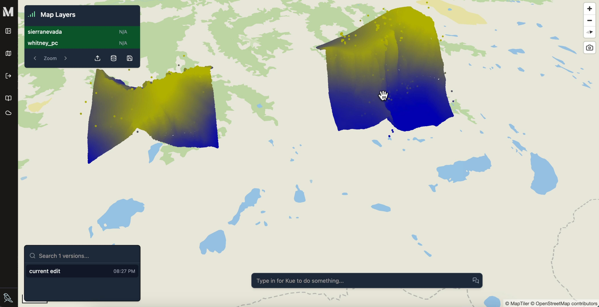
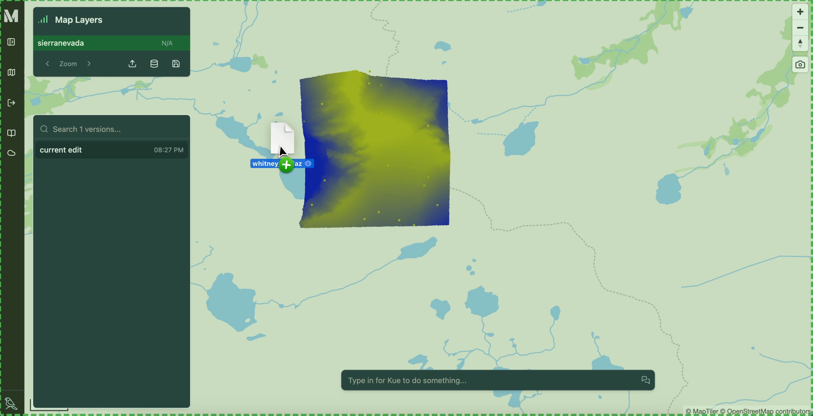
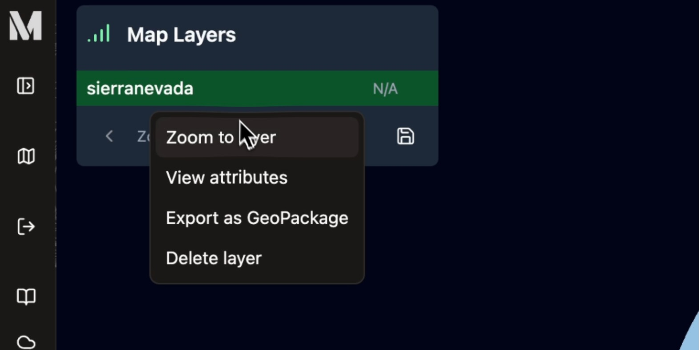

[Open source Mundi](https://github.com/BuntingLabs/mundi.ai) includes built-in support for visualizing [point cloud data](https://en.wikipedia.org/wiki/Point_cloud). You
can directly upload and interact with LiDAR data in both `.las` and compressed
`.laz` formats in versions before sharing the visualizations with your team.

This guide will walk you through uploading your first point cloud, explain
which point cloud data formats are supported, and show you how to
interact with the data in a 3D map environment.

## Uploading a .laz or .las file

You can upload your `.laz` or `.las` file either by dragging and dropping the file
onto the map, or you can click the Upload File button in the bottom right corner
of the layer list panel (which is towards the top left of the map canvas).

Mundi will automatically process the file to make sure that it's in a compatible
file format for the visualization engine ([Deck.gl](https://deck.gl/) and [MapLibre](https://maplibre.org/)).

### Format, version, and size requirements

- **File size**: Mundi cloud currently supports up to **100MB** point cloud files (`.laz` files are smaller than `.las` files)
  due to the shared cloud environment. We'll be raising the limit in the future.
- **LASer version**: [LASer formats 1.0, 1.1, 1.2, 1.3, and 1.4](https://en.wikipedia.org/wiki/LAS_file_format)
  should all be supported, and we automatically convert the file to 1.3.
- **CRS**: LiDAR data must be annotated with a CRS present in PROJ and it will be automatically converted to `EPSG:4326`.

:::note
The 100MB file size limit is temporary, but you can still effectively visualize large point clouds by downsampling them.
You can use the [lastools](https://lastools.github.io/) `las2las` utility or PDAL to downsample the point cloud before
uploading it.

The smaller the file, the faster it will be to visualize in the browser! Your end users may not have as strong of a computer as yours.
:::

Mundi currently does not support point cloud file formats outside of LASer, but we're planning on adding support for:

- Entwine Point Tiles (EPT)
- E57 files

Pull requests adding support for these formats are welcome!

## Working with point cloud data

After processing (this may take a while for larger files), the point cloud will appear in the layer list.
You'll be able to click on the layer to trigger a dropdown, allowing you to zoom to the layer or delete the layer
from your map.

### Navigating in 3D

Effectively visualizing the point cloud normally requires you to view it at an angle (off-nadir).
To do this, hold your right mouse button down and drag the mouse left/right/up/down. This quickly
becomes intuitive, but is hard to figure out on your own! You can keep zooming with the scroll wheel
and panning by left clicking.

## Symbology

Right now, all uploaded point clouds are independently styled based on their z (altitude) value.
Mundi calculates the approximate percentile of each z value, with respect to the entire point cloud,
and colors it from blue, the lowest, to yellow, the highest.

This is fairly simple, but will be incrementally improved upon in the future. We'll be adding coloration
based on classification next probably but are happy to hear suggestions.
