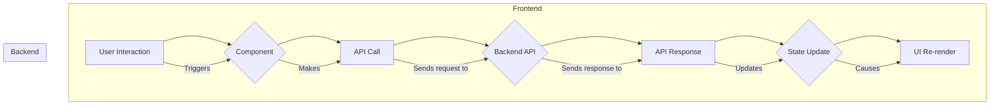

# Frontend Architecture

This document outlines the architecture of the Mundi.ai frontend, located in the `frontendts` directory. The frontend is a modern web application built with **React**, **TypeScript**, and **Vite**.

## Directory Structure

The `frontendts/src` directory is organized as follows:

-   **`components/`**: Contains reusable React components that make up the user interface.
    -   **`ui/`**: A subdirectory for generic, low-level UI components like buttons, dialogs, and input fields, based on shadcn/ui.
-   **`pages/`**: Holds the main page components of the application.
-   **`lib/`**: Contains utility functions, type definitions, and modules for handling specific functionalities like API calls and authentication.
-   **`hooks/`**: Includes custom React hooks for managing state and side effects in a reusable way.
-   **`assets/`**: Stores static assets like images and icons.
-   **`main.tsx`**: The main entry point of the application.

## Component-Based Architecture

The frontend follows a component-based architecture, where the UI is composed of small, reusable components. This makes the codebase easier to manage, test, and scale.

-   **High-Level Components**: The `pages` directory contains high-level components that represent entire pages of the application.
-   **Low-Level Components**: The `components` directory contains more generic components that can be used across multiple pages.
-   **UI Primitives**: The `components/ui` directory provides a set of basic UI primitives that are used to build more complex components.

## State Management

Application state is managed using a combination of React's built-in state management (`useState`, `useContext`) and custom hooks.

-   **Local Component State**: For state that is specific to a single component, `useState` is used.
-   **Shared State**: For state that needs to be shared across multiple components, custom hooks and React's Context API are used.
-   **Persisted State**: The `usePersistedState` custom hook in `lib/usePersistedState.tsx` is used to persist state in the browser's local storage.

## Data Flow

The data flow in the application is unidirectional, which makes it predictable and easier to debug.

1.  **API Interaction**: Data is fetched from the backend API using functions that are typically called from within React components or custom hooks.
2.  **State Update**: The fetched data is stored in the component's state.
3.  **UI Render**: The UI is re-rendered to reflect the new state.
4.  **User Interaction**: User interactions can trigger new API calls or state updates, starting the cycle again.

### Data Flow Diagram

